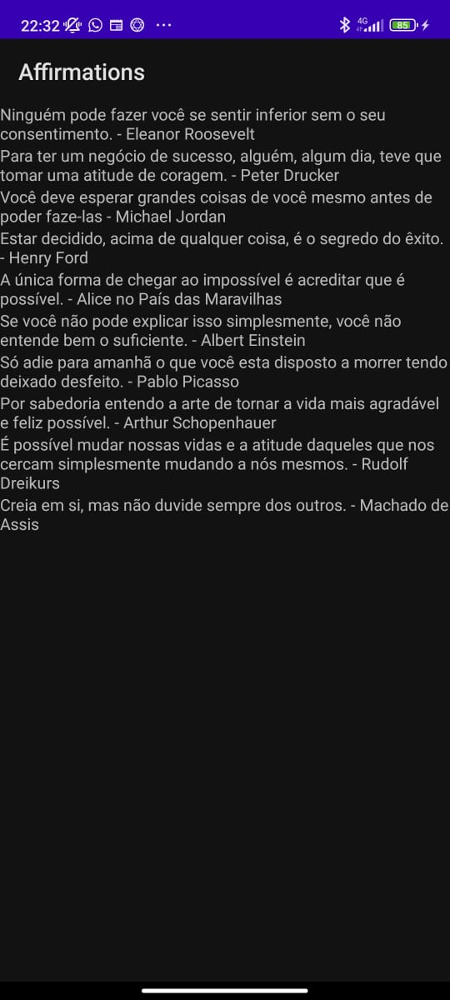

## ✉️ | Affirmations

Projeto criado nas aulas de PdAMI (Programação de Aplicação Mobile I), aqui aprendemos a fazer interligação com DataContext, modelos e adaptadores.

## 🖼️ | Imagens de protótipo

